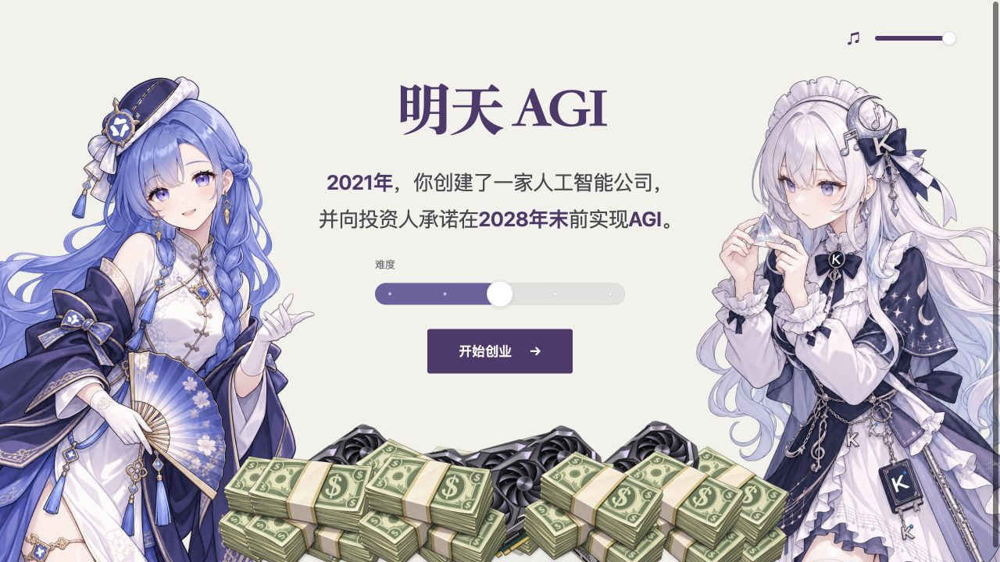
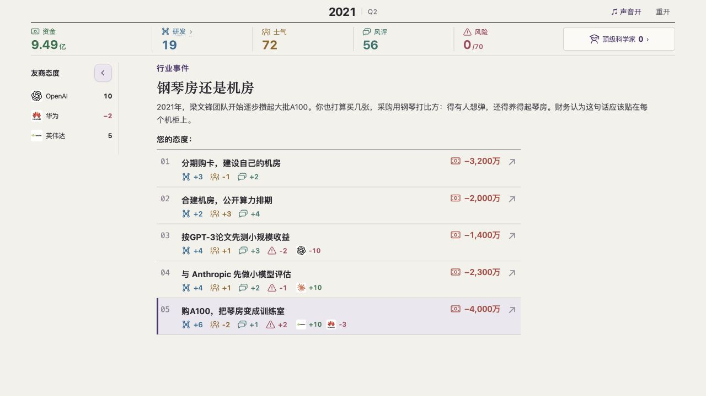
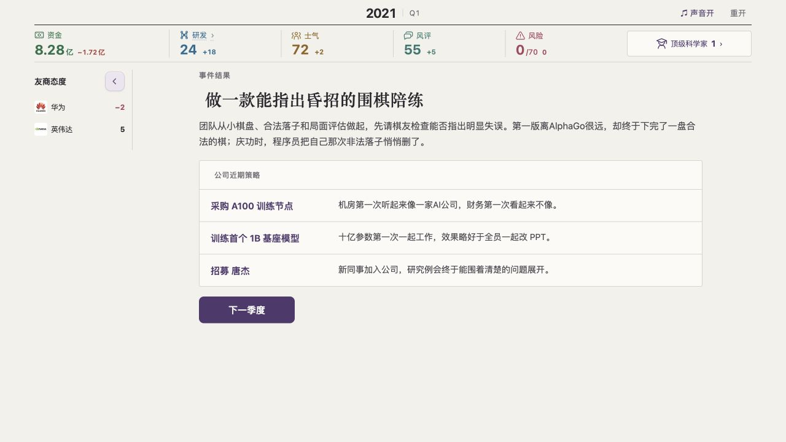

# 明天 AGI

**距离 AGI 只剩最后一步。距离发工资也只剩最后一天。**

一款中文 AI 创业经营文字游戏。你带着 10 亿元，从 2021 年出发，在 2028 年末前向投资人兑现 AGI 的承诺。

每个季度，先处理一件行业事件，再从九项公司策略中选择三项。研发、现金、团队士气、公众评价和友商关系，会把公司带向不同的未来。

## 运行游戏

### [▶ 手机、电脑直接玩](https://tiga001.github.io/AGI-tomorrow/)

安卓和 iPhone 都可以打开链接游玩，无需下载或安装。可以把这个链接直接发到 QQ 群。

进度保存在当前浏览器中，刷新可继续。不同浏览器、设备及在线版与离线版的进度各自独立。声音从首次交互开始播放，也可以用右上角开关控制。

### [⬇ 点击下载《明天 AGI》](https://github.com/Tiga001/AGI-tomorrow/releases/latest/download/AGI-tomorrow.html)

**无需安装，无需解压。下载后双击即可离线游玩。**

1. 下载 **`AGI-tomorrow.html`**。
2. 双击文件，用 Chrome、Edge、Firefox 或 Safari 打开。
3. 点击游戏里的“开始创业”。

图片、音乐和音效均已内嵌。使用旧离线版遇到声音问题时，请重新下载最新版。

### 寻找热心人士

觉得这个题材有意思，想一起把它做得更好吗？

目前游戏内容主要由 AI 辅助设计，文本、数值和平衡性还有不少打磨空间。欢迎感兴趣的朋友一起参与：润色剧情与文案、调整经营数值、设计事件和结局，或是试玩找问题、分享建议。不一定要会写代码，每一份反馈都能让游戏更好玩。

如果你愿意帮忙，欢迎在 Issues 留言或提交 PR，一起把《明天 AGI》慢慢打磨好。

### 自己运行或部署

运行 `python3 build_web.py` 生成 `web-dist/`，把该目录完整上传到静态网站托管服务。网页版本分开加载图片和音乐，不依赖外部字体、CDN 或后端。

GitHub Pages 从 `main` 分支的 `/docs` 发布。更新后运行 `python3 build_web.py --pages`，将源码与 `docs/` 一起提交；运行 `python3 build.py` 可生成 `dist/index.html` 离线单文件。

## 游戏截图

展开查看当前游戏界面

## 免责声明

1. **这是虚构与戏仿作品。** 部分背景取材于公开行业信息，但玩家公司、具体对话、招募、人物归属、合作关系、经营数值、策略结果和结局均经过游戏化改写，不应作为现实事实或新闻引用。2027—2028 年的故事属于架空创作，不是预测。
2. **不代表任何官方立场。** 游戏中出现的公司、产品、人物姓名及标识，其相关权利归各自权利人所有；出现这些名称不表示其参与制作、授权、赞助或认可本游戏。
3. **虚构情节不构成现实指控。** 例如中转站替换模型的剧情中，服务商、对话和查证过程为虚构，不指向现实中的特定中转服务，也不表示相关模型官方参与。人物的招募及公司归属仅服务于玩法。
4. **策略选项不代表作者倡导。** 抹黑、欺骗、违规经营等选项用于呈现经营后果和讽刺效果，不是现实行为指南。本游戏不提供投资、职业或商业决策建议。
5. **素材授权分别适用。** 源码公开不等于所有图片、音乐、商标及衍生角色都可任意使用或商用。转载、修改或再发布时，请保留相应署名并遵守各自许可证。
6. 如发现事实标注、署名或素材授权方面的问题，请通过本仓库 [Issues](https://github.com/Tiga001/AGI-tomorrow/issues) 提供具体内容和来源，便于核查、修正或移除。

## 素材与授权

本项目包含不同来源的素材，**没有为整个仓库声明一份统一许可证，也尚未为自有代码和文案单独指定许可证**。

| 内容 | 来源与许可 |
| --- | --- |
| GPT、DeepSeek、Claude、Gemini、Grok、Qwen、Kimi、MiniMax、GLM 同人角色图 | 参考 ZipZipPipe《大 AI 与小 AI 们》的角色设计；DeepSeek 鲸鱼娘原设为上善无形、二次设计为 ZipZipPipe。经 AI 辅助重新绘制；**CC BY-NC-SA 4.0**，含非商业限制。见[完整署名](assets/cover/CREDITS.txt)与[逐张参考记录](assets/cover/action-sources.json)。 |
| 背景音乐与事件结算声 | Millennium Dawn；**CC BY-SA 4.0**。见[音乐署名](assets/music/CREDITS.txt)、[音效署名](assets/sfx/CREDITS.txt)及各目录许可证。 |
| 部分品牌图标 | Lobe Icons，**MIT**；标识相关权利仍归原权利人。见[许可证](assets/LOBE-ICONS-LICENSE.txt)与[图标来源](assets/sources.json)。 |
| 事件选择确认音 | 为本游戏原创合成，并非《钢铁雄心 IV》的原版录音；详见[音效说明](assets/sfx/CREDITS.txt)。 |
| 结局音乐 | 为本游戏原创编排，通过 Web Audio 实时合成；未使用外部录音采样。详见[音乐说明](assets/music/CREDITS.txt)。 |

离线 HTML 中也保留了素材署名和许可证链接。
