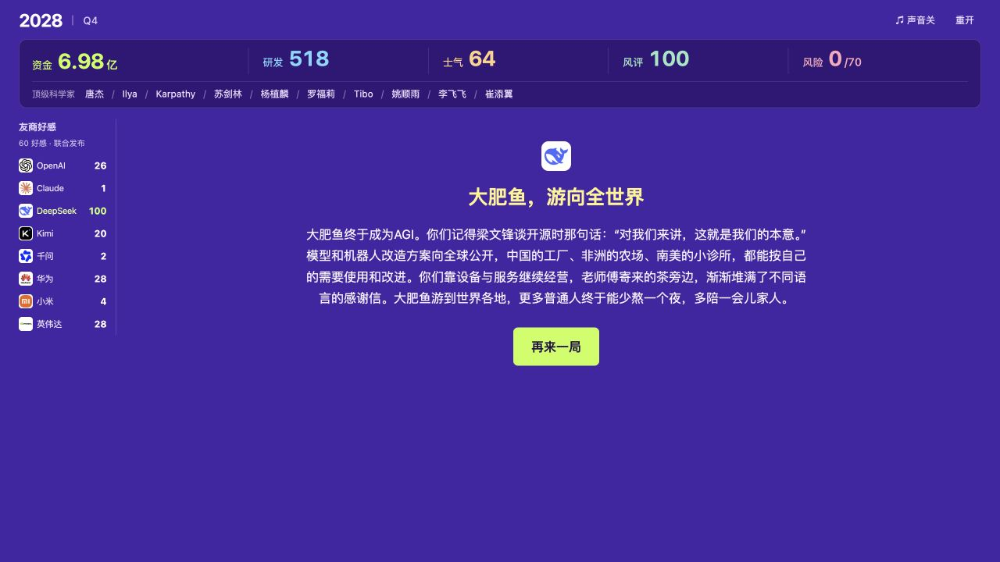

# 明天 AGI

**距离 AGI 只剩最后一步。距离发工资也只剩最后一天。**

一款中文 AI 创业经营文字游戏。你带着 10 亿元，从 2021 年出发，在 2028 年之前向投资人兑现 AGI 的承诺。

每个季度，先处理一件行业事件，再选择三项公司策略。研发、现金、团队士气、公众评价和厂商关系，会把公司带向不同的未来。

## 下载与打开

**普通玩家无需安装 Python、Node.js 或任何依赖。**

1. 点击本页绿色 **Code → Download ZIP**，或[直接下载完整游戏](https://github.com/Tiga001/AGI-tomorrow/archive/refs/heads/main.zip)。
2. 解压下载的 ZIP 文件。
3. 用 Chrome、Edge、Firefox 或 Safari 打开 **`dist/index.html`**，点击“开始创业”。

`dist/index.html` 是完整的离线版，图片、音乐、音效和游戏代码都已内嵌。也可以在 GitHub 打开该文件后，点击 **Download raw file** 单独下载，再用浏览器打开。GitHub 的文件预览页不会直接运行游戏。

如果没有声音，点击右上角的声音开关；浏览器通常需要一次点击后才允许播放音频。

## 结局截图

展开查看 DeepSeek 开放 AGI 结局（含剧透）

**大肥鱼，游向全世界**

## 免责声明

1. **这是虚构与戏仿作品。** 部分背景取材于公开行业信息，但玩家公司、具体对话、招募、人物归属、合作关系、经营数值、策略结果和结局均经过游戏化改写，不应作为现实事实或新闻引用。2027—2028 年的故事属于架空创作，不是预测。
2. **不代表任何官方立场。** 游戏中出现的公司、产品、人物姓名及标识，其相关权利归各自权利人所有；出现这些名称不表示其参与制作、授权、赞助或认可本游戏。
3. **虚构情节不构成现实指控。** 例如中转站替换模型的剧情中，服务商、对话和查证过程为虚构，不指向现实中的特定中转服务，也不表示相关模型官方参与。人物的招募及公司归属仅服务于玩法。
4. **策略选项不代表作者倡导。** 抹黑、欺骗、违规经营等选项用于呈现经营后果和讽刺效果，不是现实行为指南。本游戏不提供投资、职业或商业决策建议。
5. **素材授权分别适用。** 源码公开不等于所有图片、音乐、商标及衍生角色都可任意使用或商用。转载、修改或再发布时，请保留相应署名并遵守各自许可证。
6. 如发现事实标注、署名或素材授权方面的问题，请通过本仓库 [Issues](https://github.com/Tiga001/AGI-tomorrow/issues) 提供具体内容和来源，便于核查、修正或移除。

## 素材与授权

本项目包含不同来源的素材，**没有为整个仓库声明一份统一许可证，也尚未为自有代码和文案单独指定许可证**。

| 内容 | 来源与许可 |
| --- | --- |
| DeepSeek、Claude 同人角色图 | 参考上善无形与 ZipZipPipe 的角色设计，经 AI 辅助重新绘制；**CC BY-NC-SA 4.0**，含非商业限制。见[完整署名](assets/cover/CREDITS.txt)。 |
| 背景音乐与事件结算声 | Millennium Dawn；**CC BY-SA 4.0**。见[音乐署名](assets/music/CREDITS.txt)、[音效署名](assets/sfx/CREDITS.txt)及各目录许可证。 |
| 部分品牌图标 | Lobe Icons，**MIT**；标识相关权利仍归原权利人。见[许可证](assets/LOBE-ICONS-LICENSE.txt)与[图标来源](assets/sources.json)。 |
| 事件选择确认音 | 为本游戏原创合成，并非《钢铁雄心 IV》的原版录音；详见[音效说明](assets/sfx/CREDITS.txt)。 |

离线 HTML 中也保留了素材署名和许可证链接。
